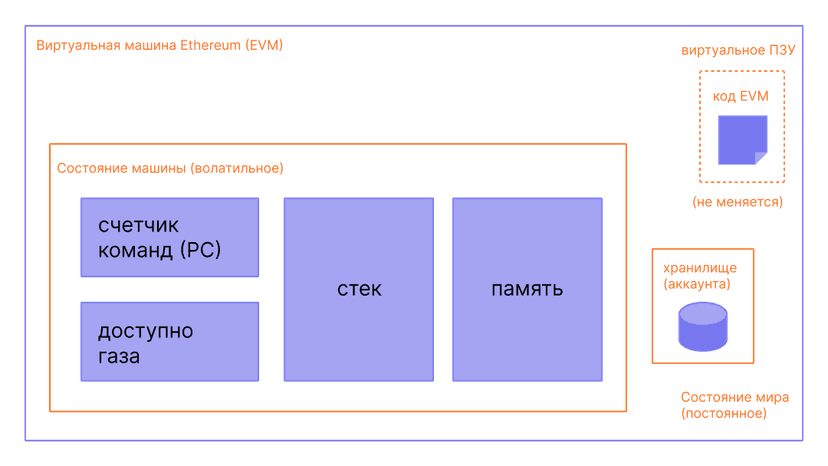

# Основы разработки Smart контрактов на децентрализованной платформе Ethereum

## Смарт контракты и их роль в децентрализованных системах

Умные контракты - основа для создания децентрализованных приложений в системе Ethereum. Они представляют собой
программы на языке Solidity, хранящиеся непосредственно на блокчейне. Код контракта гарантированно выполняется
в соответствии с определенными в нём правилами. После интегрирования в систему не может быть изменён.

Основной смысл умных контрактов - автоматизация исполнения условий и действий на блокчейне.

### Наиболее частые варианты использования

#### Базовые финансовые операции с криптовалютой

Организация таких услуг как кредитование, обмен цифровыми активами и их хранение, оплата услуг (например покупка NFT)

#### Голосования и приятие решений по управлению

Смарт-контракты могут быть использованы для проведения голосований, принятия решений и управления
организациями или сообществами. Они обеспечивают прозрачность и надежность процесса голосования.
Как пример, разработчики платформы Ethereum устраивают голосования для участников по поводу внедрения новых
функций или обновлений.

#### Умные договоры

Смарт контракт может описывать договор между пользователями и обеспечивать выполнение его условий без посредников.
Это может быть полезно в различных областях, таких как недвижимость, страхование и логистика.

#### Автоматизация бизнес-процессов

Смарт-контракты позволяют автоматизировать выполнение бизнес-процессов, улучшая эффективность и снижая издержки.
Они могут выполнять функции известных платёжных систем, только с цифровыми активами. Также можно использовать
их для сбора необходимой информации и ведения учёта данных. Умный контракт не обязательно должен выполнять именно
операции с финансами.

#### Создание интерактивных приложений

Пожалуй наиболее интересный кейс применения смарт-контрактов. При помощи одного или нескольких контрактов
(в зависимости от сложности логики) можно создавать децентрализованные приложения, которые будут
работать на блокчейне. Они могут предоставлять доступ к различным сервисам, играм, рынками и так далее.
Такие приложения используют блокчейн Ethereum для хранения данных и смарт-контракты для своих алгоритмов.
Из этого следует, что они не имеют централизованного сервера и придерживаются принципа неизменяемости кода.

## Язык Solidity для разработки смарт контрактов

### Особенности языка

Язык Solidity относительно новый, появился в 2014 году для программирования в блокчейне Ethereum. Синтаксис
напоминает JavaScript и в меньшей степени C++.

- Программы транслируются в машинный код при помощи Ethereum Virtual Machine (EVM)
- Статически типизированный
- Объектно ориентированный, роль объектов в нём выполняют не классы, а контракты
- Возвращаемые значения динамически типизированные
- Поддерживает наследование, в том числе и множественное, которое реализовано в таком же виде, как и в C++
- Есть возможность объявления структур при помощи ключевого слова `struct`

### Типы данных

Solidity предоставляет немалое количество типов данных, включая как стандартные для большинства языков
программирования, так и уникальные. В данном разделе рассмотрены основные типы языка.

#### Целочисленные

Целые числа представлены типами `int` и `uint` - знаковые и беззнаковые соответственно. По умолчанию имеют размер
в 256 бит. Также можно указать число бит от 8 до 256, как например `int8` и `uint64`.

**Важно уточнить, что в системе Ethereum требуется оплата в эфирах за ресурсы, затрачиваемые при каждом исполнении кода
(то есть за майнинг). Для измерения объема этих ресурсов существует единица измерения Газ - минимальный объем работы,
процессируемый в сети Ethereum. По этой причине оптимизация крайне необходима. Отчасти этим и обусловлено такое
разнообразие целочисленных типов.**

Предпочтительно использовать тип `bool` для значений, принимающих значения `true` и `false`.

#### Нецелочисленные

**На данный момент ещё не имеют полной поддержки согласно документации: могут быть объявлены, но не могут быть
присвоены.**

Объявляются при помощи ключевых слов `fixed` и `ufixed` - знаковые и беззнаковые числа с фиксированной запятой.
Размер можно указать следующим образом: `ufixedMxN`, где M - число бит кратное 8 (8 - 265), а N - количество
знаков после запятой (0 - 80).

#### Адреса

Тип `address` - адрес, имеющий размер 20 бит. Как правило используется для обозначения пользователя блокчейна.
`address payable` - адрес, на который можно отправлять эфир.

#### Массивы

- `bytes1`, `bytes2`, ... , `bytes32` - байтовые массивы фиксированной длины
- `<type>[n]` - массивы указанного типа фиксированной длины
- `bytes` и `<type>[]` - динамические массивы байтов и указанного типа. Имеют метод push для добавления элементов.
- `mapping` - словарь с ключами произвольного типа и значениями
- `string` - динамические строки

#### Перечисления

Обозначаются ключевым словом `enum` и могут содержать не более 256 значений. Каждое значение сопоставляется
с целым числом начиная с 0.

```solidity
enum ActionChoices { GoLeft, GoRight, GoStraight, SitStill }
```

#### Структуры

В Solidity можно объявлять C-подобные структуры следующим образом:

```solidity
struct student {
        string name;
        string subject;
        uint8 marks;
    }
```

#### События

События в Solidity - это специальные механизмы, которые позволяют контракту Ethereum уведомлять
внешние приложения о произошедших событиях. События используются для создания журнала действий в контрактах
и облегчают взаимодействие с внешними интерфейсами, такими как веб-приложения или другие контракты.

Объявляются при помощи ключевого слова `event`:

```solidity
event Transfer(address indexed from, address indexed to, uint256 amount);
```

Вызываются при помощи ключевого слова `emit`:

```solidity
function transfer(address _to, uint256 _amount) public {
    // Логика перевода токенов
    emit Transfer(msg.sender, _to, _amount);
}
```

#### Объекты

Вместо привычных классов в Solidity существуют контракты, объявляемые ключевым словом `contract`.

- Переменные внутри контракта - состояние объекта
- Для создания объекта можно определить функцию `constructor` с параметрами или без
- Внутри можно объявлять методы при помощи слова `function`
- Для создания объекта контракта используется ключевое слово `new`

### Библиотеки

Использование и создание библиотек - важная часть разработки умных контрактов. Увеличение объема кода в контракте
напрямую сказывается на росте стоимости его использования, так как для этого становится необходимо большее
количество газа. По этой причине разумно объединять часто используемые функции в отдельные библиотеки.

Функции в Solidity не могут быть объявлены вне объектов, поэтому для библиотек существует специальный тип
объектов. Чтобы создать библиотеку, нужно вместо ключевого слова `contract` написать `library`.

```solidity
library ExampleMathLibrary {
    function add(uint a, uint b) public pure returns (uint) {
        return a + b;
    }
    
}
```

Библиотеки не могут иметь переменных состояния. В них можно объявлять только константы, структуры и перечисляемые
типы.

Использовать библиотеку можно при помощи ключевого слова `using`. Если библиотека находится в другом файле, её
необходимо включить в текущий при помощи `import`.

```solidity
import "./ExampleMathLibrary.sol" as MathLibrary;

contract MyContract {
    using MathLibrary for uint;

    function calculate(uint x, uint y) public view returns (uint) {
        return x.add(y);
    }
}
```

`using` позволяет использовать библиотеку напрямую из экземпляров типа

## Ethereum Virtual Machine

Виртуальная машина Ethereum концептуально отличается от виртуальных машин других языков программирования,
таких как например Java с JVM. Она не располагается на каком-то отельном компьютере, а существует как единое
целое благодаря тысячам машин, подключённых к клиенту Ethereum. При любом заданном блоке в цепочке Ethereum
есть одно и только одно «каноничное» состояние системы.

Ethereum представляет собой распределенную машину состояний. Состояние Ethereum — это большая структура данных,
которая хранит все счета, балансы и состояние машины. Состояние машины может изменяться от блока к блоку
в соответствии с заранее определенным набором правил и может выполнять произвольный машинный код.
Конкретные правила изменения состояния от блока к блоку определяются EVM.



Скомпилированный байт-код умного контракта исполняется как последовательность машинных кодов EVM,
таких, как стандартные машинные операции XOR, AND, ADD, SUB, и т.д.
В стековой машине EVM также есть и специальные op-коды блокчейна, такие, как ADDRESS, BALANCE, BLOCKHASH и т.д.

Пример того, как может выглядеть opcode:

```text
... MLOAD DUP1 SWAP2 SUB SWAP1 RETURN JUMPDEST PUSH2 0x70 PUSH1 0x4 DUP1 CALLDATASIZE SUB DUP2 ADD SWAP1 PUSH2 0x6B
    SWAP2 SWAP1 PUSH2 0xE2 JUMP JUMPDEST PUSH2 0x7A JUMP JUMPDEST STOP JUMPDEST PUSH0 DUP1 SLOAD SWAP1 POP SWAP1
    JUMP JUMPDEST DUP1 PUSH0 DUP2 SWAP1 SSTORE POP POP JUMP JUMPDEST PUSH0 DUP2 SWAP1 POP SWAP2 SWAP1 POP JUMP
    JUMPDEST PUSH2 0x95 DUP2 PUSH2 0x83 JUMP JUMPDEST DUP3 MSTORE POP POP JUMP JUMPDEST PUSH0 PUSH1 0x20 DUP3 ...
```

После компиляции и развёртывания контракта его байт-код загружается на блокчейн и становится доступным для выполнения.
Когда вызывается функция контракта, EVM выполняет соответствующие op-коды из байт-кода контракта.

## Структура контрактов и проектов по их созданию

### Структура смарт контракта на примере

Рассмотрим основные элементы контракта и их значение на простом примере.

```solidity
// SPDX-License-Identifier: GPL-3.0

pragma solidity >=0.7.0 <0.9.0;

contract MyContract {

    address public owner;
    uint public totalSupply;
    mapping(address => uint) public balances;

    // Событие для отслеживания транзакций
    event Transfer(address indexed from, address indexed to, uint value);

    // Вызывается при создании контракта
    constructor() {
        owner = msg.sender;
        totalSupply = 1000;
        balances[msg.sender] = totalSupply;
    }

    // Проверят чтобы только владелец контракта мог выполнять определенные функции
    modifier onlyOwner() {
        require(msg.sender == owner, "Only owner can call this function");
        _;
    }

    // Сорешение перевда между пользователями
    function transfer(address to, uint value) public {
        require(balances[msg.sender] >= value, "Insufficient balance");
        
        balances[msg.sender] -= value;
        balances[to] += value;
        
        emit Transfer(msg.sender, to, value);
    }

    // Позволяет владельцу добавить новые токены
    function mint(uint amount) public onlyOwner {
        totalSupply += amount;
        balances[msg.sender] += amount;
    }

    // Позволяет владельцу уничтожить некое количество токенов
    function burn(uint amount) public onlyOwner {
        require(balances[msg.sender] >= amount, "Insufficient balance");
        
        totalSupply -= amount;
        balances[msg.sender] -= amount;
    }
}
```

Контракт в данном примере предоставляет базовые функции управления токенами.

1. В начале файла обязательно указывается версия языка при помощи `pragma solidity`. Можно указать как какую-то
конкретную вервию либо промежуток, как в примере.
2. После версии языка указываются импорты нужных библиотек если такие имеются.
3. Далее объявляется сам контракт, внутри которого будет находиться вся его логика. Название контракта принято
писать с заглавной буквы.
4. В начале контракта объявляются его переменные состояния. Они могут быть изменены при помощи методов
по мере существования объекта. При необходимости использования библиотек при помощи ключевого слова
`using`. Это также следует указывать в разделе состояния.
5. После состояния может быть объявлен конструктор, код которого выполнится при создании.
6. Затем в теле конструктора объявляются его функции. Помимо функций в примере используется `modifier`.
С его помощью можно добавлять дополнительную логику к функциям. В данном случае он проверяет чтобы только
создатель контракта мог выполнять определенные функции путём сравнения адресов. Такая практика приветствуется,
чтобы избежать повторения одного и того же кода.
7. В одном файле также может быть несколько контрактов, в таком случае они должны располагаться один за другим.
8. Вложенные контракты тоже поддерживаются: они объявляются внутри родительского, имеют доступ к его переменным
и функциям. Доступ к ним есть только изнутри родительского контракта.

### Структура проекта и среды разработки

Использование специальных программных инструментов сильно облегчает структурирование, разработку и тестирование
проектов на Solidity.

Поддержка программирования на языке Solidity есть во многих средах разработки. Как например в Visual Studio Code и
IntelliJ IDEA доступны к установке специальные плагины для этого. Есть специализированные, такие как
Truffle Suite для разработки приложений на основе Ethereum и Remix IDE - веб-среда разработки, которая позволяет
писать, тестировать и размещать смарт-контракты на блокчейне Ethereum. Примеры в данной статье как раз были
написаны при помощи Remix IDE.

В корневой директории лучше всего создать отдельные папки для файлов с разным назначением. В проекте могут
быть следующие разделы:

- Файлы самих контрактов. После компиляции первого контракта в папке с ними будет создана директория artifacts,
содержащая файлы сборки в формате json
- Файлы для развёртывания контрактов на блокчейне. Как правило пишутся на языке JavaScript или TypeScript
- Возможно имеет смысл вынести в отдельную директорию файлы с библиотеками
- Тесты для контрактов. Могут быть написаны как на Solidity, так и на JS
- Конфигурационные файлы в зависимости от используемых ИДЕ и фреймворков

## Безопасность

В данном разделе рассмотрены наиболее распространённые ошибки в коде умных контрактов, которые могут привести
к уязвимостям в безопасности, и советы по их решению.

### Ограничение прав

Как правило, контракт предполагает использование людьми, которые логически различаются на различные роли. К примеру,
продавец и покупатели, организатор голосования и электорат и так далее. Логично предположить, что предполагаемый
покупатель не должен иметь доступ к получению полученных за покупки средств или добавлению / удалению доступных
товаров.

Для обеспечения ограничения прав для определенных пользователей следует добавлять необходимые проверки в нужных
функциях. Можно использовать `modifier` для ограничения доступа к целым функциям как это было показано в примере
ранее. Для проверки нужных требований используется `requier(//проверка нужной логики)`. Следующий за этим
выражением код выполнится только если выражение в скобках примет значение `true`.

### Целочисленное переполнение

Довольно стандартная проблема для многих языков программирования. Тем более Solidity имеет довольно строгую типизацию
для целочисленных типов. Перед написанием кода стоит задуматься о том, какие минимальные и максимальные значения
могу принимать переменные. Также необходима и валидация входящих значений.

Для предотвращения переполнения целочисленных переменных также можно использовать библиотеку SafeMath. Она
сделана для обеспечения безопасных арифметических операций.

### Рекурсивные вызовы

Более неочевидная при разработке проблема, которая однако может привести к серьезным ошибкам. Как пример, по этой
причине произошёл так называемый взлом DAO в 2016 году: пользователь, используя эту уязвимость в коде, умудрился
перевести себе около 4 млн. эфира.

Рекурсивный вызов возможен когда смарт контракт совершает вызов к другому внешнему контракту до того,
как изменения состояния были зафиксированы. После этого внешний контракт может рекурсивно взаимодействовать
с исходным смарт-контрактом недопустимым способом, так как его баланс еще не обновлен.

Решение может зависеть от конкретной ситуации. Можно использовать модификаторы для ограничения количества
рекурсивных вызовов, флаги состояния для предотвращения повторных вызовов функций во время выполнения других функций,
строить код таким образом, чтобы изменения состояния фиксировались перед возможными вызовами такого рода.

## Тестирование

Тесты для контрактов можно писать как на Solidity - отдельные контракты, так и на js.
Также для написания интеграционных тестов для смарт-контрактов на Ethereum можно использовать различные инструменты
и фреймворки, такие, как Truffle, Hardhat, или Web3.js.

В большинстве случаев вызов функций контрактов предполагает манипуляцию с криптовалютой эфир. По это причине
для тестирования существует тестовая сеть Ethereum, которая работает аналогично настоящей, но в ней есть
доступ к фиктивным эфирам. Для использования тестовой сети Ethereum нужно подключиться к ней из написанного приложения
или с помощью сред разработки, что значительно упростит процесс.

## Deploy

Для развертывания смарт-контракта на блокчейне Ethereum необходим кошелек с эфирами,
контрактный код и доступ к сети Ethereum.

Deploy можно организовать при помощи скрипта на js/ts с использованием библиотек, таких как Web3 или ethers.

Простой пример с ethers:

```typescript
import { ethers } from 'ethers'

/**
 * Deploy the given contract
 * @param {string} contractName name of the contract to deploy
 * @param {Array<any>} args list of constructor' parameters
 * @param {Number} accountIndex account index from the exposed account
 * @return {Contract} deployed contract
 */
export const deploy =
  async (contractName: string, args: Array<any>, accountIndex?: number): Promise<ethers.Contract> => {    

  console.log(`deploying ${contractName}`)
  // Note that the script needs the ABI which is generated from the compilation artifact.
  // Make sure contract is compiled and artifacts are generated
  const artifactsPath = `browser/contracts/artifacts/${contractName}.json` // Change this for different path

  const metadata = JSON.parse(await remix.call('fileManager', 'getFile', artifactsPath))
  // 'web3Provider' is a remix global variable object
    
  const signer = (new ethers.providers.Web3Provider(web3Provider)).getSigner(accountIndex)

  const factory = new ethers.ContractFactory(metadata.abi, metadata.data.bytecode.object, signer)

  const contract = await factory.deploy(...args)   

  // The contract is NOT deployed yet; we must wait until it is mined
  await contract.deployed()
  return contract
}
```

```typescript
import { deploy } from './ethers-lib'

(async () => {
  try {
    const result = await deploy('Storage', [])
    console.log(`address: ${result.address}`)
  } catch (e) {
    console.log(e.message)
  }
})()
```

## Заключение

В данной статье были рассмотрены основные положения, которые необходимы, чтобы начать создавать собственные программы
на языке Solidity. Цель данной статьи - в основном общие рекомендации, так как для создания реальных приложений
потребуется изучать многие пункты более подробно.
